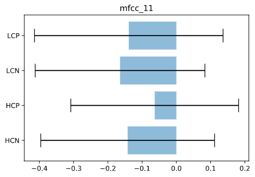
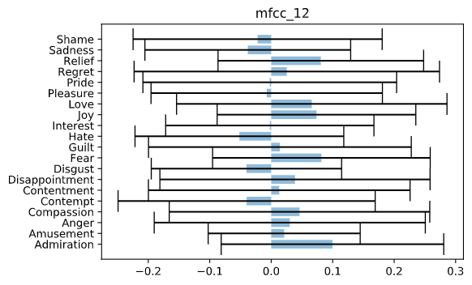
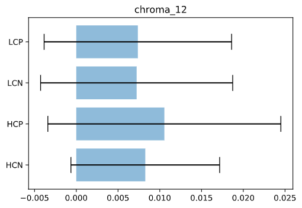

# Georgia Tech Robotic Musicianship Prosody Audio Analysis

## Background
The Robotic Musicianship group aims to facilitate meaningful musical interactions between humans and machines, leading to novel musical experiences and outcomes. In our research, we combine computational modeling approaches for perception, interaction, and improvisation, with novel approaches for generating acoustic responses in physical and visual manners.

The motivation for this work is based on the hypothesis that real-time collaboration between human and robotic players can capitalize on the combination of their unique strengths to produce new and compelling music. Our goal is to combine human qualities, such as musical expression and emotions, with robotic traits, such as powerful processing, the ability to perform sophisticated mathematical transformations, robust long-term memory, and the capacity to play accurately without practice.

## Purpose
The purpose of this repository is to provide documentation for the work performed by the Prosody Machine Learning Team. Human emotion is conveyed via many mediums, one of which is prosody. In linguistics, prosody is concerned with those elements of speech that are not individual phonetic segments but are properties of syllables and larger units of speech, including linguistic functions such as intonation, tone, stress, and rhythm. The main goals for this lab are 1. to classify emotion based on prosody and 2. to generate prosody for specific emotions.

## Methodology
During the summer of 2020, a 4.4 hour long dataset containing hundreds of audio clips labeled with a specific emotion was collected. This dataset, and more to come, will serve as the backbone for the models and algorithms generated this semester of Fall 2020. 

## Results from PyAudioAnalysis Feature Extraction and Model Training
During the first week with this dataset, our team decided to explore the accuracy of various classification models implemented by the popular python library PyAudioAnalysis. We trained and tested the following types of models: KNN, SVM, Random Forests, Extra Trees, and Gradient Boosting. Additionally we trained with two types of classification: All 20 emotions separated individually and the 20 emotions divided into 4 categories determined by the intersection of control and valance. The categories can be visualized as follows: 
| High Control, Negative Valance | High Control, Positive Valance | Low Control, Negative Valance | Low Control, Positive Valance |
|---|---|---|---|
| Anger | Amusement | Disappointment | Admiration |
| Contempt | Interest | Fear | Compassion |
| Disgust | Joy | Guilt | Contentment |
| Hate | Pleasure | Sadness | Love |
| Regret | Pride | Shame | Relief |

All models were trained with the following parameters consistent:
- Mid-term Window Step = 1.0 seconds
- Mid-term Window Size = 1.0 seconds
- Short-term Window Step = 0.05 seconds
- Short-term Window Size = 0.05 seconds
- computeBeat = False

The models achieved the following accuracies and f1 scores:
| Model | Classification | Best Accuracy | Best F1 | Best Hyperparameter |
|---|---|---|---|---|
| KNN | Big4 | 56.1 | 56.2 | C=11 |
| SVM | Big4  | 66.5 | 65.3 | C=1.0 |
| Extra Trees |  Big4 | 64.6 | 64.3 | C=100 |
| Gradient Boosting | Big4  | 67.0 | 66.7 | C=500 |
| Random Forest | Big4  | 63.5 | 63.2 | C=200 |
| KNN | Individual | 33.8 | 32.1 | C=15 |
| SVM | Individual | 49.1 | 48.1 | C=5.0 |
| Extra Trees | Individual | 44.3 | 42.8 | C=500 |
| Gradient Boosting | Individual | 47.2 | 46.6 | C=200 |
| Random Forest | Individual | 43.8 | 42.3 | C=200 |
|SVM|Love Vs Disgust|98.9|98.9|C=.01|

### Big4 Classification
The confusion matrix for Gradient Boosting on the Big4 Classification has been shown below. Notice the difficulty the model has in distinguishing between Low Control Positive Valance and High Control Positive Valance.

||HCN|HCP|LCN|LCP|
|---|---|---|---|---|
|HCN|20.82|2.38|2.46|1.39|
|HCP|2.21|15.16|2.38|5.66|
|LCN|2.87|2.13|15.66|2.30|
|LCP|1.39|5.16|2.62|15.41|

### Individual Classification
The confusion matrix for SVM on the Individual Classification has been shown below. Although this can be hard to read, it is useful to visualize which emotions are being confused for each other. A few interesting observations include: 

- Disgust is rarely confused with other emotions. 
- Fear and Guilt are the two most common pair of emotions to confuse for one another. 
- Pleasure is the hardest emotion to correctly classify.

||Adm|Amu|Ang|Com|Con|Con|Disa|Disg|Fear|Gui|Hate|Int|Joy|Love|Ple|Pri|Reg|Rel|Sad|Sha|
|---|---|---|---|---|---|---|---|---|---|---|---|---|---|---|---|---|---|---|---|---|
|Adm|2.29|0.41|0.08|0.00|0.08|0.00|0.24|0.00|0.00|0.00|0.16|0.24|0.24|0.08|0.16|0.00|0.00|0.08|0.00|0.00|
|Amu|0.16|3.18|0.00|0.00|0.00|0.00|0.00|0.16|0.08|0.00|0.08|0.33|0.33|0.00|0.00|0.08|0.00|0.08|0.00|0.00|
|Ang|0.00|0.08|2.94|0.00|0.41|0.08|0.00|0.16|0.16|0.08|0.41|0.00|0.08|0.08|0.08|0.08|0.00|0.08|0.00|0.16|
|Com|0.08|0.00|0.00|2.20|0.08|0.41|0.49|0.00|0.16|0.16|0.00|0.16|0.00|0.16|0.00|0.41|0.00|0.00|0.00|0.16|
|Con|0.33|0.08|0.65|0.00|1.88|0.00|0.16|0.16|0.49|0.33|0.33|0.08|0.08|0.00|0.16|0.00|0.41|0.08|0.00|0.08|
|Con|0.49|0.16|0.08|0.98|0.08|1.71|0.08|0.00|0.08|0.16|0.00|0.08|0.00|0.08|0.33|0.08|0.16|0.00|0.24|0.08|
|Disa|0.08|0.00|0.16|0.16|0.00|0.00|2.45|0.16|0.08|0.33|0.00|0.08|0.08|0.00|0.08|0.08|0.00|0.16|0.00|0.16|
|Disg|0.08|0.33|0.24|0.00|0.08|0.00|0.16|5.31|0.16|0.00|0.08|0.00|0.00|0.00|0.00|0.00|0.00|0.08|0.00|0.00|
|Fear|0.08|0.00|0.24|0.08|0.33|0.00|0.08|0.08|2.53|0.49|0.16|0.00|0.00|0.08|0.24|0.08|0.08|0.08|0.08|0.16|
|Gui|0.08|0.08|0.08|0.08|0.08|0.24|0.08|0.00|1.14|2.45|0.00|0.00|0.00|0.00|0.24|0.24|0.24|0.00|0.08|0.16|
|Hate|0.00|0.16|0.57|0.00|0.33|0.00|0.00|0.24|0.16|0.00|3.35|0.08|0.33|0.24|0.00|0.00|0.00|0.08|0.16|0.00|
|Int|0.24|0.82|0.00|0.24|0.16|0.65|0.16|0.00|0.00|0.00|0.00|2.12|0.00|0.08|0.24|0.16|0.08|0.08|0.16|0.08|
|Joy|0.49|0.57|0.08|0.16|0.16|0.00|0.08|0.00|0.08|0.00|0.33|0.08|2.53|0.33|0.41|0.08|0.08|0.24|0.00|0.00|
|Love|0.16|0.16|0.08|0.82|0.08|0.41|0.00|0.00|0.16|0.24|0.08|0.24|0.16|1.96|0.33|0.33|0.00|0.00|0.08|0.00|
|Ple|0.41|0.00|0.00|0.73|0.16|0.49|0.24|0.08|0.00|0.41|0.00|0.41|0.00|0.82|1.06|0.16|0.24|0.16|0.08|0.24|
|Pri|0.24|0.00|0.16|0.16|0.08|0.16|0.08|0.00|0.08|0.08|0.00|0.00|0.08|0.33|0.08|2.37|0.00|0.16|0.00|0.00|
|Reg|0.08|0.00|0.24|0.41|0.08|0.16|0.16|0.08|0.08|0.49|0.16|0.08|0.00|0.00|0.41|0.16|1.47|0.16|0.08|0.16|
|Rel|0.16|0.00|0.08|0.16|0.16|0.08|0.16|0.33|0.00|0.08|0.24|0.16|0.16|0.08|0.08|0.00|0.00|4.00|0.16|0.00|
|Sad|0.00|0.00|0.33|0.08|0.00|0.16|0.24|0.16|0.00|0.00|0.24|0.24|0.00|0.08|0.00|0.00|0.00|0.24|1.71|0.16|
|Sha|0.08|0.00|0.08|0.16|0.16|0.33|0.24|0.08|0.65|0.33|0.16|0.00|0.00|0.16|0.08|0.33|0.33|0.08|0.08|1.55|

### Disgust vs Love Classification
When tasked with categorizing between two emotions, our model performs extremely well. Achieving accuracies as high as 98.9% with a f1 of 98.9 in the distinction between Love and Disgust using a SVM. This reinforces the intuition that by reducing the number of emotional categories we can achieve exceptionally high accuracies for identification. The confusion matrix is shown below:
||Dis|Love|
|---|---|---|
|Dis|54.03|1.14|
|Love|0.00|44.83|

## Understanding Feature Extraction 

In the following section you will learn about the features used in the models trained above. Each python algorithm displayed is derived from the open source python library "pyAudioAnalysis". All example extractions are implementations of the algorithm shown with the same parameters set consistent as outlined in the previous section. Graph values are the mean across all audio files of a particular emotion, with one standard deviation shown as an error bar.

//TODO: Add the following sections to each of the features listed below: Why is this feature important?, mathematical representation of algorithms
### Zero Crossing Rate
#### Description
Zero Crossing Rate is the rate of sign-changes across a signal (the rate at which the signal changes from positive negative or from negative to positive). 
#### Why is this important?
This feature is key in classifying percussive sounds. One study analyzed ZCR for Anger, Fear, Neutral, and Happy signals. The study noted that higher peaks were found for Happy and Anger emotions. The study did not calculate if these differences were statistically [4]. (maybe ZCR is not important for emotion)

Specific to this data set, the ZCR likely varies largely from person to person since it is highly dependent on whether an individual thinks that a specific emotion should have percussive information. As we continue to analyze more data it will be useful to look at the distribution of the ZCR between individuals.

#### Algorithm

where 's' is a signal of length 'T' and '1_r<0' is an indicator function

In Python:

    def zero_crossing_rate(frame):
        """Computes zero crossing rate of frame"""
        count = len(frame)
        count_zero = np.sum(np.abs(np.diff(np.sign(frame)))) / 2
        return np.float64(count_zero) / np.float64(count - 1.0)

#### Example Extraction
|Individual|Big 4|
|---|---|
|||

### Energy
#### Description
Energy is defined as the area under the squared magnitude of the considered signal
#### Why is this important?
The energy of a signal loosely relates to the amount of spectral information in a signal.
#### Algorithm

Unit of E_s will be (unit of signal)^2.

In Python:

    def energy(frame):
        """Computes signal energy of frame"""
        return np.sum(frame ** 2) / np.float64(len(frame))

#### Example Extraction
|Individual|Big 4|
|---|---|
|||

### Entropy of Energy
#### Description
The entropy of energy is defined as the average level of "information" or "uncertainty" inherent within a signal's energy
#### Why is this important?
The signal with high entropy of energy would a signal that varies largely in the energy throughout. Entropy can be reduced through signal compression and increased through signal expansion. To accurately measure the entropy of the different emotions, we need to make sure we are not including parts of the signal where the individual is not speaking.
#### Algorithm

In Python:

    def energy_entropy(frame, n_short_blocks=10):
        """Computes entropy of energy"""
        # total frame energy
        frame_energy = np.sum(frame ** 2)
        frame_length = len(frame)
        sub_win_len = int(np.floor(frame_length / n_short_blocks))
        if frame_length != sub_win_len * n_short_blocks:
            frame = frame[0:sub_win_len * n_short_blocks]

        # sub_wins is of size [n_short_blocks x L]
        sub_wins = frame.reshape(sub_win_len, n_short_blocks, order='F').copy()

        # Compute normalized sub-frame energies:
        s = np.sum(sub_wins ** 2, axis=0) / (frame_energy + eps)

        # Compute entropy of the normalized sub-frame energies:
        entropy = -np.sum(s * np.log2(s + eps))
        return entropy

#### Example Extraction
|Individual|Big 4|
|---|---|
|||
### Spectral Centroid
#### Description
The spectral centroid characterizes a signal's spectrum, the amount of vibration at each individual frequency, defined by the spectrum's center of mass. 

#### Why is this important?
Perceptually, a spectral centroid has a connection with a sound's brightness. It follows, that this parameter serves as an indicator of musical timbre. //TODO expand this section

#### Algorithm

where x(n) represents the weighted frequency magnitude of frame number n and f(n) represents the center frequency of that frame.

In Python:

    def spectral_centroid_spread(fft_magnitude, sampling_rate):
        """Computes spectral centroid of frame (given abs(FFT))"""
        ind = (np.arange(1, len(fft_magnitude) + 1)) * \
            (sampling_rate / (2.0 * len(fft_magnitude)))

        Xt = fft_magnitude.copy()
        Xt = Xt / Xt.max()
        NUM = np.sum(ind * Xt)
        DEN = np.sum(Xt) + eps

        # Centroid:
        centroid = (NUM / DEN)

        # Spread:
        spread = np.sqrt(np.sum(((ind - centroid) ** 2) * Xt) / DEN)

        # Normalize:
        centroid = centroid / (sampling_rate / 2.0)
        spread = spread / (sampling_rate / 2.0)

        return centroid, spread

#### Example Extraction
|Individual|Big 4|
|---|---|
|||

### Spectral Entropy
#### Description
Spectral Entropy is defined to be the entropy of the power spectral density of a signal. The power spectral density of a signal describes the distribution of power into frequency components composing that signal.
#### Why is this important?
Signals with high spectral entropy will have a large spectral distribution. For reference, a sine wave has very low spectral entropy while white noise has a very high spectral entropy. One study found that the use of spectral entropy showed an improvement in speech recognition when used with MFCC features, however using only spectral entropy did not perform better than using only MFCC [5].
#### Algorithm
Power Spectral Density:

where 

In Python:

    def spectral_entropy(signal, n_short_blocks=10):
        """Computes the spectral entropy"""
        # number of frame samples
        num_frames = len(signal)

        # total spectral energy
        total_energy = np.sum(signal ** 2)

        # length of sub-frame
        sub_win_len = int(np.floor(num_frames / n_short_blocks))
        if num_frames != sub_win_len * n_short_blocks:
            signal = signal[0:sub_win_len * n_short_blocks]

        # define sub-frames (using matrix reshape)
        sub_wins = signal.reshape(sub_win_len, n_short_blocks, order='F').copy()

        # compute spectral sub-energies
        s = np.sum(sub_wins ** 2, axis=0) / (total_energy + eps)

        # compute spectral entropy
        entropy = -np.sum(s * np.log2(s + eps))

        return entropy

#### Example Extraction
|Individual|Big 4|
|---|---|
|||

### Spectral Flux
#### Description
Spectral flux is a measure of the rate of change of the power spectrum of a signal. More precisely, spectral flux is usually calculated as the Euclidean distance between sequential frames.

#### Why is this important?
Spectral flux relates to how fast the pitch changes in time.
#### Algorithm
//TODO Write formal definition

In Python:

    def spectral_flux(fft_magnitude, previous_fft_magnitude):
        """
        Computes the spectral flux feature of the current frame
        ARGUMENTS:
            fft_magnitude:            the abs(fft) of the current frame
            previous_fft_magnitude:        the abs(fft) of the previous frame
        """
        # compute the spectral flux as the sum of square distances:
        fft_sum = np.sum(fft_magnitude + eps)
        previous_fft_sum = np.sum(previous_fft_magnitude + eps)
        sp_flux = np.sum(
            (fft_magnitude / fft_sum - previous_fft_magnitude /
            previous_fft_sum) ** 2)

        return sp_flux

#### Example Extraction
|Individual|Big 4|
|---|---|
|||

### Spectral Roll-Off
#### Description
The spectral roll-off is defined as the frequency under which some percentage of the total energy of the spectrum is contained.

#### Why is this important?
Spectral Roll-off helps differentiate between harmonic content, characterized below the roll-off, and noisy sounds, characterized above the roll-off. //TODO Expand

#### Algorithm

In Python:

    def spectral_rolloff(signal, c):
        """Computes spectral roll-off"""
        energy = np.sum(signal ** 2)
        fft_length = len(signal)
        threshold = c * energy
        # Ffind the spectral rolloff as the frequency position 
        # where the respective spectral energy is equal to c*totalEnergy
        cumulative_sum = np.cumsum(signal ** 2) + eps
        a = np.nonzero(cumulative_sum > threshold)[0]
        if len(a) > 0:
            sp_rolloff = np.float64(a[0]) / (float(fft_length))
        else:
            sp_rolloff = 0.0
        return sp_rolloff

#### Example Extraction
|Individual|Big 4|
|---|---|
|||

### Mel Frequency Cepstral Coefficients
#### Description
Mel-Frequency Cepstral Coefficient (MFCC) is an important and powerful analytical tool used in speech analysis. The significant of the MFCC is that it the distribution of analyzed frequency bands are non-linear and resembles the logarithmic hearing of humans.
#### Why is this important?
Many studies have linked the importance of MFCC analysis to emotion recognition [1][2][3]. 
#### Algorithm
{\rm Mel}({\rm f})=2595\log_{10}(1+{\rm f}/700)\eqno{\hbox{(1)}}

In Python:

    def mfcc(fft_magnitude, fbank, num_mfcc_feats):
        """
        Computes the MFCCs of a frame, given the fft mag

        ARGUMENTS:
            fft_magnitude:  fft magnitude abs(FFT)
            fbank:          filter bank (see mfccInitFilterBanks)
        RETURN
            ceps:           MFCCs (13 element vector)

        Note:    MFCC calculation is, in general, taken from the 
                scikits.talkbox library (MIT Licence),
        #    with a small number of modifications to make it more 
            compact and suitable for the pyAudioAnalysis Lib
        """

        mspec = np.log10(np.dot(fft_magnitude, fbank.T) + eps)
        ceps = dct(mspec, type=2, norm='ortho', axis=-1)[:num_mfcc_feats]
        return ceps

#### Example Extraction
|Individual|Big 4|
|---|---|
|||
|||
|||
|||
|||
|||
|||
|||
|||
|||
|||
|||
|||

### Chroma Vector
#### Description
A chroma vector is an approximation of the pitch class profiles present within a given frame. In music, this can be thought of as a classification of twelve tones.

#### Why is this important?
Chroma vectors allow for the capture of harmonic and melodic characteristics while remaining robust toward changes in timbre and instrumentation.

#### Algorithm

In Python:

    def chroma_features(signal, sampling_rate, num_fft):

        num_chroma, num_freqs_per_chroma = \
            chroma_features_init(num_fft, sampling_rate)
        chroma_names = ['A', 'A#', 'B', 'C', 'C#', 'D',
                        'D#', 'E', 'F', 'F#', 'G', 'G#']
        spec = signal ** 2
        if num_chroma.max() < num_chroma.shape[0]:
            C = np.zeros((num_chroma.shape[0],))
            C[num_chroma] = spec
            C /= num_freqs_per_chroma[num_chroma]
        else:
            I = np.nonzero(num_chroma > num_chroma.shape[0])[0][0]
            C = np.zeros((num_chroma.shape[0],))
            C[num_chroma[0:I - 1]] = spec
            C /= num_freqs_per_chroma
        final_matrix = np.zeros((12, 1))
        newD = int(np.ceil(C.shape[0] / 12.0) * 12)
        C2 = np.zeros((newD,))
        C2[0:C.shape[0]] = C
        C2 = C2.reshape(int(C2.shape[0] / 12), 12)

        final_matrix = np.matrix(np.sum(C2, axis=0)).T
        final_matrix /= spec.sum()

        return chroma_names, final_matrix

    def chroma_features_init(num_fft, sampling_rate):
        """
        This function initializes the chroma matrices used in the calculation
        of the chroma features
        """
        freqs = np.array([((f + 1) * sampling_rate) /
                        (2 * num_fft) for f in range(num_fft)])
        cp = 27.50
        num_chroma = np.round(12.0 * np.log2(freqs / cp)).astype(int)

        num_freqs_per_chroma = np.zeros((num_chroma.shape[0],))

        unique_chroma = np.unique(num_chroma)
        for u in unique_chroma:
            idx = np.nonzero(num_chroma == u)
            num_freqs_per_chroma[idx] = idx[0].shape

        return num_chroma, num_freqs_per_chroma

#### Example Extraction
|Individual|Big 4|
|---|---|
|||
|||
|||
|||
|||
|||
|||
|||
|||
|||
|||
|||

### Chroma Deviation

#### Description
The standard deviation of the 12 chroma coefficients.
#### Why is this important?
This gives insight into the distribution and spread of the spectral energy in the chroma vector.
#### Algorithm

#### Example Extraction
|Individual|Big 4|
|---|---|
|||

## Works Cited (WIP)

1.	F. S. A., V. K. V.R., R. S. A., A. Jayakumar and B. A. P., "Speaker Independent Automatic Emotion Recognition from Speech: A Comparison of MFCCs and Discrete Wavelet Transforms," 2009 International Conference on Advances in Recent Technologies in Communication and Computing, Kottayam, Kerala, 2009, pp. 528-531, doi: 10.1109/ARTCom.2009.231.
2.	K. V. Krishna Kishore and P. Krishna Satish, "Emotion recognition in speech using MFCC and wavelet features," 2013 3rd IEEE International Advance Computing Conference (IACC), Ghaziabad, 2013, pp. 842-847, doi: 10.1109/IAdCC.2013.6514336.
3. https://doi.org/10.1016/j.procs.2015.10.020
4. https://ieeexplore.ieee.org/stamp/stamp.jsp?arnumber=8228105
5. https://www.researchgate.net/profile/Sven_Nordholm/publication/247612912_Spectral_entropy_as_speech_features_for_speech_recognition/links/54843daf0cf2e5f7ceaccbb9/Spectral-entropy-as-speech-features-for-speech-recognition.pdf
